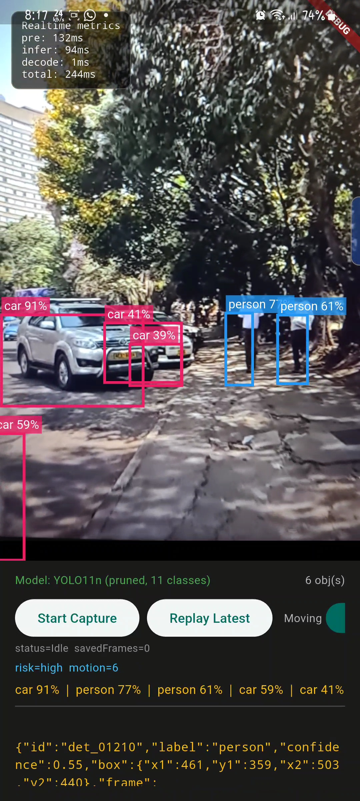

# Rutendo AI

Edge AI navigation assistant for the visually impaired. Runs entirely on-device — no internet required.

**AI4I Challenge 2026 — Development Track | Project ID: RUT-AI4I-DEV-001**

## Pipeline

```
Camera frame (640x480)
  → Background Isolate: YUV→RGB → Resize to 640x640 → Normalize NCHW
  → TFLite GPU Delegate (YOLO11n, 11 classes, ~10.7 MB)
  → RawYoloDecoder (column-major 15×8400 + NMS)
  → SimpleTracker (cross-frame ID matching)
  → MotionEstimator (velocity & trajectory)
  → Risk Engine (zone, distance, priority scoring)
  → Audio Cues (WAV + flutter_soloud) + Haptic Cues
```

## Screenshot



## Quick Start

```bash
# Flutter app
cd rutendo_ai
flutter pub get
flutter run

# Python AI lab (model training/export)
cd ai_lab
conda activate ai-resume
pip install -r requirements.txt
python src/prototype_detection.py -i videos/test.mp4
```

## Key Components

| Component | Location | Purpose |
|-----------|----------|---------|
| Camera + TFLite | `lib/features/safety/widgets/` | Live capture, background isolate inference |
| YOLO Decoder | `lib/features/safety/services/raw_yolo_decoder.dart` | TFLite output parsing |
| Tracker | `lib/features/safety/services/tracker.dart` | Cross-frame object tracking |
| Motion Estimator | `lib/features/safety/services/motion_estimator.dart` | Velocity/trajectory estimation |
| Risk Engine | `lib/features/safety/services/risk_engine.dart` | Hazard scoring and prioritisation |
| Audio Engine | `lib/features/safety/services/audio_engine_service.dart` | Directional beep playback |
| AI Lab | `ai_lab/` | Model training, pruning, export |

## Testing

```bash
cd rutendo_ai
flutter test
```

21 tests passing (risk engine, tracker, motion estimator, audio engine, detection parser).

## License

MIT